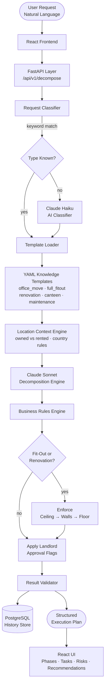
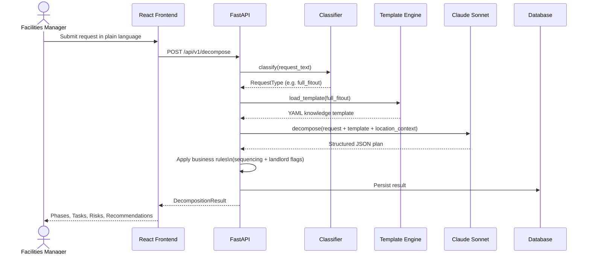
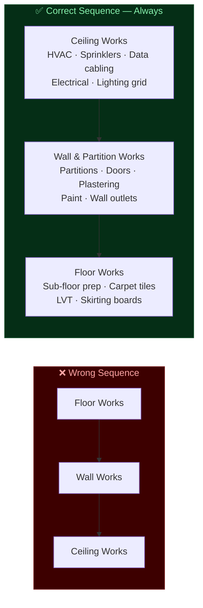
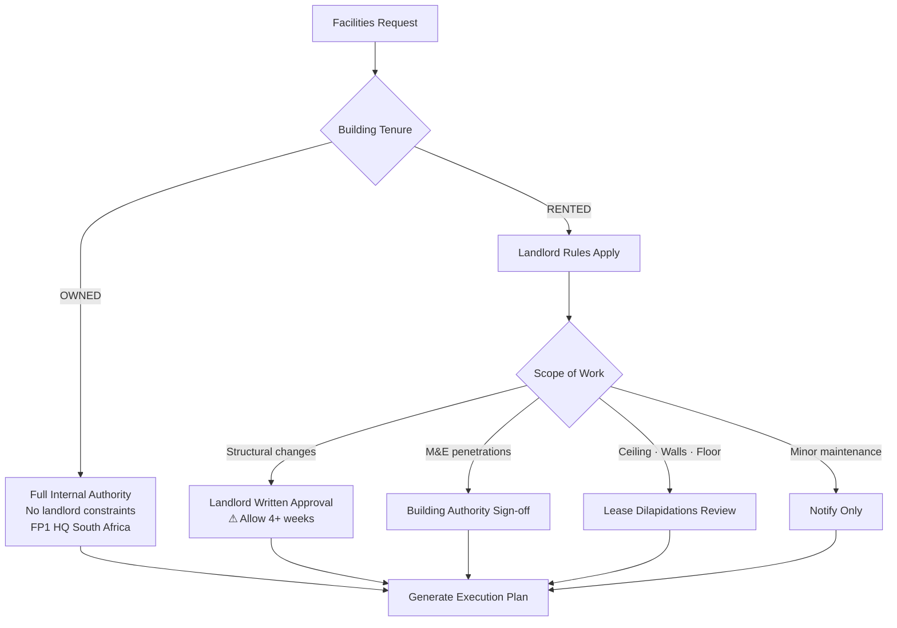
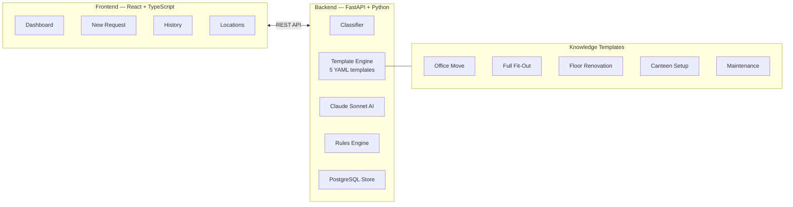
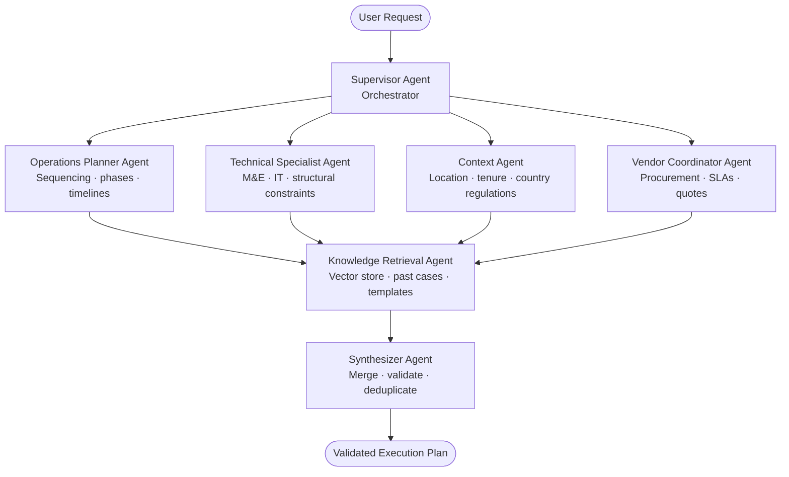

# SpaceMind OS

> **The AI that thinks like a 30-year veteran Facilities Manager.**
>
> Turn any natural language facilities request into a fully structured, sequenced, responsibility-aware execution plan — across owned and rented multi-country offices.

---

## System Architecture



---

## Request Flow — Detailed



---

## Knowledge Engine — Fit-Out Sequencing Rule



---

## Location & Tenure Logic



---

## Phase 1 — Current MVP



---

## Phase 2 — Multi-Agent Roadmap



---

## Getting Started

### Prerequisites

- Python 3.11+
- Node.js 20+
- An [Anthropic API key](https://console.anthropic.com/)

### Backend

```bash
# 1. Clone
git clone https://github.com/SifisoScS/spacemind-os.git
cd spacemind-os

# 2. Set up environment
cp .env.example .env
# Edit .env — add your ANTHROPIC_API_KEY

# 3. Install dependencies
pip install -r requirements.txt

# 4. Run the API
python run_dev.py
# → http://localhost:8000
# → http://localhost:8000/docs  (Swagger UI)
```

### Frontend

```bash
cd frontend
npm install
npm run dev
# → http://localhost:5173
```

### Docker (full stack)

```bash
docker-compose up --build
# API  → http://localhost:8000
# UI   → http://localhost:5173
```

---

## API Reference

| Method | Endpoint | Description |
|--------|----------|-------------|
| `POST` | `/api/v1/decompose` | Submit a facilities request |
| `GET` | `/api/v1/history` | List all past decompositions |
| `GET` | `/api/v1/history/{id}` | Retrieve a specific plan |
| `GET` | `/api/v1/locations` | List all known office locations |
| `GET` | `/api/v1/health` | System health check |

### Example request

```bash
curl -X POST http://localhost:8000/api/v1/decompose \
  -H "Content-Type: application/json" \
  -d '{
    "request_text": "Move 40 staff from FP1 to FP2 within the next 6 weeks",
    "location_id": "FP2_SouthAfrica",
    "priority": "high"
  }'
```

---

## Knowledge Templates

| Template | Operation Type | Key Rule |
|----------|---------------|----------|
| `office_move.yaml` | Staff relocation | IT readiness is always critical path |
| `full_fitout.yaml` | New office build | Ceiling → Walls → Floor, non-negotiable |
| `floor_renovation.yaml` | Occupied floor refresh | Phased approach, nights/weekends |
| `canteen_setup.yaml` | Canteen / kitchen | HACCP compliance, gas certification |
| `maintenance.yaml` | Reactive & planned | P1/P2/P3 triage, SLA enforcement |

---

## Office Locations

| Location ID | Country | Tenure | Landlord Required |
|-------------|---------|--------|------------------|
| `FP1_HQ_SouthAfrica` | South Africa | Owned | No |
| `FP2_SouthAfrica` | South Africa | Rented | Yes |
| `NAIROBI_Kenya` | Kenya | Rented | Yes |
| `LAGOS_Nigeria` | Nigeria | Rented | Yes |
| `LONDON_UK` | United Kingdom | Rented | Yes |

---

## Tech Stack

| Layer | Technology |
|-------|-----------|
| AI | Claude Sonnet 4.6 (decomposition) · Claude Haiku (classification) |
| Backend | FastAPI · Python 3.11 · Pydantic v2 |
| Database | PostgreSQL (prod) · SQLite (dev) · SQLAlchemy |
| Templates | PyYAML |
| Frontend | React 18 · TypeScript · Vite · Tailwind CSS |
| Data Fetching | TanStack Query |
| Routing | React Router v6 |
| Deployment | Docker · Nginx |

---

## Project Structure

```
spacemind-os/
├── src/spacemind/
│   ├── ai/              # Claude client + all prompts
│   ├── api/             # FastAPI routes
│   ├── core/            # Config, constants, logging
│   ├── domain/          # Pydantic schemas + ORM models
│   ├── engine/          # Classifier, decomposer, validator
│   ├── knowledge/       # YAML templates + business rules
│   ├── services/        # Application-layer orchestration
│   ├── storage/         # DB session + repository
│   └── utils/           # Helpers, location context
├── frontend/
│   └── src/
│       ├── api/         # Axios client
│       ├── components/  # Layout, decompose, history, UI atoms
│       ├── hooks/       # TanStack Query hooks
│       ├── pages/       # Dashboard, Decompose, History, Locations
│       └── types/       # TypeScript types (mirrors backend schemas)
├── tests/unit/          # Classifier + rules unit tests
├── docker-compose.yml
└── requirements.txt
```

---

*Built with Claude Sonnet 4.6 — Anthropic*
